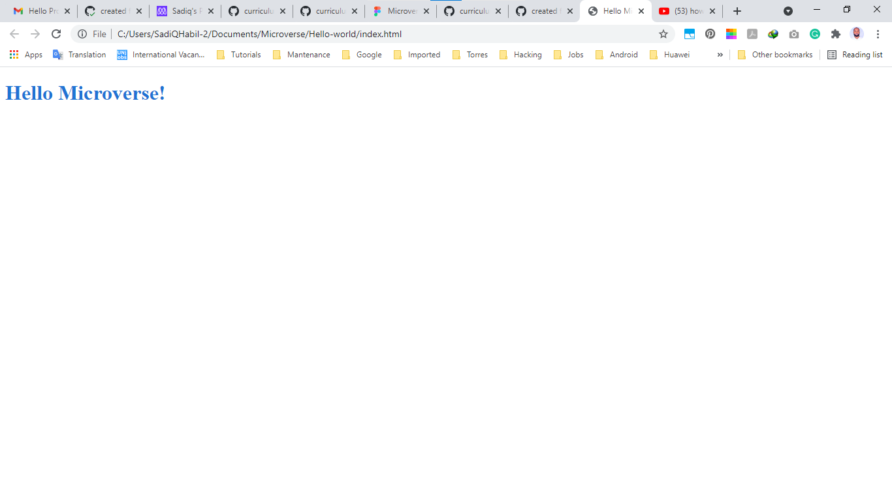

# Hello Microcverse!

> Set up a "Hello Microverse" project.

Docomented in a professional way.
Created GitHub repo.
Created new branch according to the GitHub flow.
Added gitignore file.
Set up a linter for HTML and CSS.

## Authors

👤 **SadiQ HabiL**

- GitHub: [@kingqabil](https://github.com/kingqabil)
- Twitter: [@kingqabil](https://twitter.com/kingqabil)
- LinkedIn: [@kingqabil](https://linkedin.com/in/kingqabil)

## 🤝 Contributing

Contributions, issues, and feature requests are welcome!

Feel free to check the [issues page](../../issues/).

## Show your support

Give a ⭐️ if you like this project!

## Acknowledgments

- Hat tip to anyone whose code was used
- Inspiration
- etc

## 📝 License

This project is [MIT](./MIT.md) licensed.
